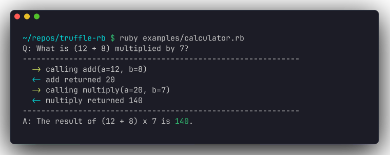

<h1 align="center">Truffle</h1>

<p align="center">
  <strong>A dependency-free Ruby agent harness, built from scratch.</strong><br>
  Tool calls, providers, sessions, compaction, streaming, and events in plain Ruby.
</p>

<p align="center">
  <a href="https://github.com/truffle-dev/truffle-rb/actions/workflows/ci.yml"></a>
  <a href="https://codecov.io/gh/truffle-dev/truffle-rb"></a>
  <a href="https://rubygems.org/gems/truffle"></a>
  <a href="truffle.gemspec">= 3.1" src="https://img.shields.io/badge/ruby-%3E%3D%203.1-CC342D"></a>
  <a href="https://github.com/rubocop/rubocop"></a>
  <a href="LICENSE"></a>
</p>

<p align="center">
  Truffle gives Ruby applications the loop that turns a language model into a
  tool-using agent: ask, call tools, feed results back, and repeat until the
  model answers. It is a faithful port of
  <a href="https://github.com/earendil-works/pi">pi</a> to idiomatic Ruby. No
  framework, no service, no runtime gem dependencies.
</p>

```ruby
require "truffle"

weather = Truffle.tool(
  "get_weather",
  "Look up city weather"
) do
  param :city,
        :string,
        "city name",
        required: true

  run do |city:|
    "22C and sunny in #{city}."
  end
end

agent = Truffle.agent(
  provider: :openai,
  model: "gpt-5-mini",
  tools: [weather]
)

question = "Weather in Lisbon?"
puts agent.run(question)
```

The model decided to call `get_weather(city: "Lisbon")`, Truffle ran your Ruby
block, handed the result back, and the model wrote the final answer. That whole
round trip is the agent loop, and it is the thing Truffle exists to give you.

<p align="center">
  
</p>

<p align="center">
  <em>The bundled calculator example: every arrow is a real tool call printed through the event API.</em>
</p>

## Why Truffle

Ruby has been missing a tiny, readable **agent runtime**: the part that owns the
turn loop, the tool dispatch, the message history, and the events a UI hangs off.
Truffle is that runtime, written from scratch.

It is a faithful port of [pi](https://github.com/earendil-works/pi), the
self-extensible coding agent harness. The aim is a byte-for-byte-faithful Ruby
port of pi's agent core, growing into a full harness with skills, commands,
sessions, and memory. You can read the whole loop in one sitting
(`lib/truffle/agent.rb`) and understand exactly what your agent does.

- **Provider-agnostic, built from scratch.** The agent talks to a single `chat`
  seam. A provider is any object that answers `chat(messages:, tools:, model:)`.
  OpenAI Chat Completions, Anthropic Messages, and Google Gemini all ship in the
  box, each written against the wire API directly with no client gem.
- **A model catalog you can trust.** `Truffle.models` is a structured registry of
  every model Truffle can address, current to its provider's published docs:
  ids, context windows, max output, modalities, reasoning support, and per-token
  pricing. `Truffle.model("claude-opus-4-8")` resolves a model (and dated
  snapshots like `gpt-4o-2024-08-06`) to its rates and capabilities.
- **Tools are plain blocks.** Define a tool with a name, a description, typed
  params, and a Ruby block. Truffle generates the JSON Schema the model needs and
  symbolizes the model's arguments back into keyword args for you.
- **Observable.** Subscribe to `agent_start`, `tool_call`, `tool_result`,
  `agent_end`, and more. Build a TUI, a log stream, or a web view without the
  harness knowing how it is rendered.
- **Dependency-free core.** Every provider uses `Net::HTTP` and the JSON in the
  standard library. Nothing to vendor, nothing to audit but the code you see.

## Install

```ruby
# Gemfile
gem "truffle"
```

```sh
bundle install
```

Or from a checkout:

```sh
gem build truffle.gemspec
gem install ./truffle-0.1.0.gem
```

Truffle targets Ruby >= 3.1.

## Quick start

Set your key and run the bundled calculator example, which shows the model
chaining several tool calls:

```sh
export OPENAI_API_KEY=sk-...
ruby examples/calculator.rb "What is (12 + 8) multiplied by 7, then add 100?"
```

```
Q: What is (12 + 8) multiplied by 7, then add 100?
------------------------------------------------------------
  -> calling add(a=12, b=8)
  <- add returned 20
  -> calling multiply(a=20, b=7)
  <- multiply returned 140
  -> calling add(a=140, b=100)
  <- add returned 240
------------------------------------------------------------
A: The final result is 240.
```

## Core concepts

### Tools

```ruby
add = Truffle.tool("add", "Add two integers") do
  param :a, :integer, "first addend", required: true
  param :b, :integer, "second addend", required: true
  run { |a:, b:| a + b }
end
```

- `param name, type, description, required:` declares an input. Types map to
  JSON Schema (`:string`, `:integer`, `:number`, `:boolean`, ...).
- `run { |a:, b:| ... }` is your handler. The model emits string keys; Truffle
  symbolizes them into keyword args. Return any value; it is stringified before
  it goes back to the model.
- Raising inside a handler does not crash the loop. The error is caught and fed
  back to the model as the tool result, so it can recover or apologize.

### Agents

```ruby
agent = Truffle.agent(
  provider: :openai,
  model: "gpt-5-mini",
  system_prompt: "You are a precise calculator.",
  tools: [add],
  max_turns: 12
)

answer = agent.run("What is 2 + 3?")
agent.reset   # clears history, keeps the system prompt and tools
```

`run` drives the loop to completion and returns the final assistant text.
`max_turns` guards against a model that never settles; exceeding it raises
`Truffle::Error`.

When a model asks for several tools in one turn, Truffle preflights them in order
and runs allowed tool bodies in parallel by default. Tool result messages are
still appended in the model's source order. Use `tool_execution: :sequential` on
the agent, or `execution_mode: :sequential` on a tool, when a batch must run one
call at a time.

### Events

```ruby
agent.on(:tool_call)   { |e| puts "-> #{e[:call].name}(#{e[:call].arguments})" }
agent.on(:tool_result) { |e| puts "<- #{e[:result]}" }
agent.on               { |type, payload| logger.debug(type => payload) }  # every event
```

Events fire in order: `agent_start`, then per turn `turn_start`, `message`,
`tool_call`/`tool_result` (one pair per tool the model invokes), `turn_end`,
and finally `agent_end`.

### Tool middleware

Two optional hooks wrap tool execution without touching the tool definitions,
ported from pi's `beforeToolCall` / `afterToolCall`. Use them for logging,
authorization, redaction, or rate limiting.

```ruby
agent = Truffle.agent(
  provider: :openai,
  tools: [read_file, write_file],
  # Veto a call before it runs. Return { block: true, reason: ... } to stop it;
  # the reason becomes the tool result the model reads. Return nil to proceed.
  before_tool_call: ->(tool_call:, **) {
    { block: true, reason: "writes are disabled" } if tool_call.name == "write_file"
  },
  # Rewrite an executed result. Return { result: ... } to override; anything else
  # (including nil) keeps the original.
  after_tool_call: ->(result:, **) {
    { result: result.gsub(/sk-[A-Za-z0-9]+/, "[redacted]") }
  }
)
```

Each hook is handed a context Hash by keyword: `:tool_call`, `:args` (the parsed
arguments), and `:messages` (the running history), plus `:result` for the after
hook. Declare only the keys you read and absorb the rest with `**`. An unknown
tool skips both hooks, and a hook that raises becomes an error result rather than
killing the loop.

### Providers

A provider is anything that implements:

```ruby
def chat(messages:, tools:, model: nil, **options)
  # -> Truffle::Response
end
```

Three providers ship in the box. `Truffle::Providers::OpenAI` talks to the Chat
Completions API, `Truffle::Providers::Anthropic` talks to the Messages API, and
`Truffle::Providers::Google` talks to the Gemini Generative Language API, all
over `Net::HTTP` with no client gem. Each also has a streaming sibling. To
target another backend, subclass `Truffle::Providers::Base` and implement
`chat`.

### The model catalog

```ruby
Truffle.models                       # => every model Truffle knows
Truffle.model("claude-opus-4-8")     # => the Opus 4.8 entry
Truffle.model("gpt-4o-2024-08-06")   # => resolves the dated snapshot to gpt-4o

opus = Truffle.model("claude-opus-4-8")
opus.context_window  # => 1_000_000
opus.reasoning?      # => true
opus.cost[:input]    # => 5.0  (US dollars per million input tokens)
```

Every entry carries its id, provider, context window, max output, input
modalities, reasoning support, and a per-million-token cost hash
(`:input`, `:output`, `:cache_read`, `:cache_write`). The catalog is the single
source of truth: `Truffle::Pricing` reads its rates, and a test fails loudly if
the current flagships ever regress to a stale lineup.

## Testing

From a local Ruby:

```sh
bundle install
rake test
bundle exec rubocop
```

The one-command path is:

```sh
script/check
```

The default suite is hermetic and offline: it drives the agent loop with a stub
provider, so you can run it anywhere without a key. A handful of live tests
perform real round trips against each provider and are **skipped unless that
provider's key is set** (`OPENAI_API_KEY`, `ANTHROPIC_API_KEY`, `GEMINI_API_KEY`).
With a key present each verifies the full path: prompt -> model requests a tool
-> Truffle runs it -> model answers with the tool's result, for both the
buffered and streaming code paths.

For live tests, copy the example file, fill in the keys you have, and use the
container runner. `.env.local` is ignored and must stay local.

```sh
cp .env.local.example .env.local
script/check
```

No local Ruby? `script/rb` runs any command inside a Ruby 3.3 container:

```sh
script/rb rake test
script/rb bundle exec rubocop
```

`script/check` uses that wrapper, installs/checks the bundle in a Docker volume,
runs `bundle exec rake test`, then runs `bundle exec rubocop`. Set
`TRUFFLE_RUBY_IMAGE`, `TRUFFLE_BUNDLE_VOLUME`, or `TRUFFLE_REPO_VOLUME` only
when you need a custom container setup.

Coverage is opt-in:

```sh
COVERAGE=true script/rb rake test
```

That writes SimpleCov output under `coverage/`. CI uploads the same report to
Codecov when the repository has Codecov upload access configured.

## Project layout

```
lib/truffle.rb                     # top-level API: Truffle.agent, Truffle.tool, Truffle.model
lib/truffle/agent.rb               # the agent loop (the heart of the port)
lib/truffle/tool.rb                # tool DSL + JSON Schema generation
lib/truffle/toolbox.rb             # a named collection of tools
lib/truffle/message.rb             # message + tool-call value objects
lib/truffle/response.rb            # a provider's reply
lib/truffle/model.rb               # a single model value object
lib/truffle/models.rb              # the model catalog (single source of truth)
lib/truffle/pricing.rb             # per-token pricing facade over the catalog
lib/truffle/providers/base.rb      # the provider seam
lib/truffle/providers/openai.rb    # OpenAI Chat Completions provider (+ openai_stream.rb)
lib/truffle/providers/anthropic.rb # Anthropic Messages provider (+ anthropic_stream.rb)
lib/truffle/providers/google.rb    # Google Gemini provider (+ google_stream.rb)
examples/calculator.rb          # runnable multi-tool demo
test/                           # minitest suite (offline + per-provider live tests)
script/rb                       # Docker-backed Ruby command runner
script/check                    # one-command test + lint verification
```

## Credits

Truffle is a from-scratch Ruby port of
[pi](https://github.com/earendil-works/pi) by Mario Zechner (MIT). pi is the
blueprint; the Ruby implementation is written from the ground up. Thanks to the
pi project for the design.

## License

MIT. See [LICENSE](LICENSE).
