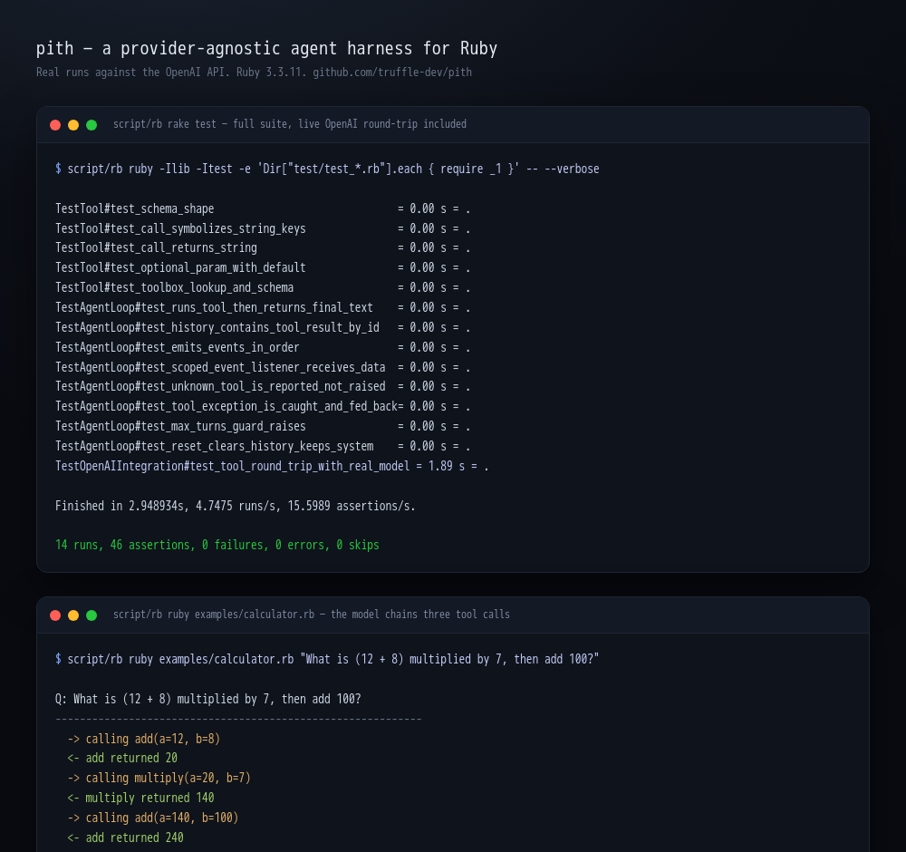

# Truffle

A complete **agent harness for Ruby**, built from scratch. Truffle gives you the
loop that turns a language model into an agent: it sends a prompt, lets the model
ask for tools, runs those tools, feeds the results back, and repeats until the
model answers. It is a faithful port of
[pi](https://github.com/earendil-works/pi) to idiomatic Ruby. No framework, no
service, no runtime gem dependencies. Plain Ruby and the standard library.

```ruby
require "truffle"

weather = Truffle.tool("get_weather", "Look up the weather for a city") do
  param :city, :string, "city name", required: true
  run { |city:| "It is 22C and sunny in #{city}." }
end

agent = Truffle.agent(
  provider: :openai,
  model: "gpt-4o-mini",
  system_prompt: "You are a concise assistant. Use tools when they help.",
  tools: [weather]
)

puts agent.run("What's the weather in Lisbon?")
# => "It's 22C and sunny in Lisbon right now."
```

The model decided to call `get_weather(city: "Lisbon")`, Truffle ran your Ruby
block, handed the result back, and the model wrote the final answer. That whole
round trip is the agent loop, and it is the thing Truffle exists to give you.



*The full suite (unit tests plus one live OpenAI round-trip) passing, and the
calculator example chaining three real tool calls to reach 240.*

## Why Truffle

Ruby has been missing a tiny, readable **agent runtime**: the part that owns the
turn loop, the tool dispatch, the message history, and the events a UI hangs off.
Truffle is that runtime, written from scratch.

It is a faithful port of [pi](https://github.com/earendil-works/pi), the
self-extensible coding agent harness. The aim is a byte-for-byte-faithful Ruby
port of pi's agent core, growing into a full harness with skills, commands,
sessions, and memory. You can read the whole loop in one sitting
(`lib/truffle/agent.rb`) and understand exactly what your agent does.

- **Provider-agnostic, built from scratch.** The agent talks to a single `chat`
  seam. A provider is any object that answers `chat(messages:, tools:, model:)`.
  An OpenAI provider ships in the box, written against the wire API directly with
  no client gem. Anthropic and other providers follow the same hand-written path.
- **Tools are plain blocks.** Define a tool with a name, a description, typed
  params, and a Ruby block. Truffle generates the JSON Schema the model needs and
  symbolizes the model's arguments back into keyword args for you.
- **Observable.** Subscribe to `agent_start`, `tool_call`, `tool_result`,
  `agent_end`, and more. Build a TUI, a log stream, or a web view without the
  harness knowing how it is rendered.
- **Dependency-free core.** The OpenAI provider uses `Net::HTTP` and the JSON
  in the standard library. Nothing to vendor, nothing to audit but the code you
  see.

## Install

```ruby
# Gemfile
gem "truffle"
```

```sh
bundle install
```

Or from a checkout:

```sh
gem build truffle.gemspec
gem install ./truffle-0.1.0.gem
```

Truffle targets Ruby >= 3.1.

## Quick start

Set your key and run the bundled calculator example, which shows the model
chaining several tool calls:

```sh
export OPENAI_API_KEY=sk-...
ruby examples/calculator.rb "What is (12 + 8) multiplied by 7, then add 100?"
```

```
Q: What is (12 + 8) multiplied by 7, then add 100?
------------------------------------------------------------
  -> calling add(a=12, b=8)
  <- add returned 20
  -> calling multiply(a=20, b=7)
  <- multiply returned 140
  -> calling add(a=140, b=100)
  <- add returned 240
------------------------------------------------------------
A: The final result is 240.
```

## Core concepts

### Tools

```ruby
add = Truffle.tool("add", "Add two integers") do
  param :a, :integer, "first addend", required: true
  param :b, :integer, "second addend", required: true
  run { |a:, b:| a + b }
end
```

- `param name, type, description, required:` declares an input. Types map to
  JSON Schema (`:string`, `:integer`, `:number`, `:boolean`, ...).
- `run { |a:, b:| ... }` is your handler. The model emits string keys; Truffle
  symbolizes them into keyword args. Return any value; it is stringified before
  it goes back to the model.
- Raising inside a handler does not crash the loop. The error is caught and fed
  back to the model as the tool result, so it can recover or apologize.

### Agents

```ruby
agent = Truffle.agent(
  provider: :openai,
  model: "gpt-4o-mini",
  system_prompt: "You are a precise calculator.",
  tools: [add],
  max_turns: 12
)

answer = agent.run("What is 2 + 3?")
agent.reset   # clears history, keeps the system prompt and tools
```

`run` drives the loop to completion and returns the final assistant text.
`max_turns` guards against a model that never settles; exceeding it raises
`Truffle::Error`.

### Events

```ruby
agent.on(:tool_call)   { |e| puts "-> #{e[:call].name}(#{e[:call].arguments})" }
agent.on(:tool_result) { |e| puts "<- #{e[:result]}" }
agent.on               { |type, payload| logger.debug(type => payload) }  # every event
```

Events fire in order: `agent_start`, then per turn `turn_start`, `message`,
`tool_call`/`tool_result` (one pair per tool the model invokes), `turn_end`,
and finally `agent_end`.

### Providers

A provider is anything that implements:

```ruby
def chat(messages:, tools:, model: nil, **options)
  # -> Truffle::Response
end
```

The bundled `Truffle::Providers::OpenAI` talks to the Chat Completions API over
`Net::HTTP`. To target another backend, subclass `Truffle::Providers::Base` and
implement `chat`. The roadmap adds first-class Anthropic and other providers,
each hand-written against the seam.

## Testing

```sh
rake test
```

The default suite is hermetic and offline: it drives the agent loop with a stub
provider, so you can run it anywhere without a key. One additional test
(`test/test_openai_integration.rb`) performs a real OpenAI round trip and is
**skipped unless `OPENAI_API_KEY` is set**. With a key present it verifies the
full path: prompt -> model requests a tool -> Truffle runs it -> model answers
with the tool's result.

No local Ruby? The repo ships `script/rb`, a thin wrapper that runs any command
inside a `ruby:3.3-slim` container, so `script/rb rake test` works on a host
with only Docker.

## Project layout

```
lib/truffle.rb                  # top-level API: Truffle.agent, Truffle.tool, Truffle.provider
lib/truffle/agent.rb            # the agent loop (the heart of the port)
lib/truffle/tool.rb             # tool DSL + JSON Schema generation
lib/truffle/toolbox.rb          # a named collection of tools
lib/truffle/message.rb          # message + tool-call value objects
lib/truffle/response.rb         # a provider's reply
lib/truffle/providers/base.rb   # the provider seam
lib/truffle/providers/openai.rb # OpenAI Chat Completions provider
examples/calculator.rb       # runnable multi-tool demo
test/                        # minitest suite (offline + one live test)
```

## Credits

Truffle is a from-scratch Ruby port of
[pi](https://github.com/earendil-works/pi) by Mario Zechner (MIT). pi is the
blueprint; the Ruby implementation is written from the ground up. Thanks to the
pi project for the design.

## License

MIT. See [LICENSE](LICENSE).
